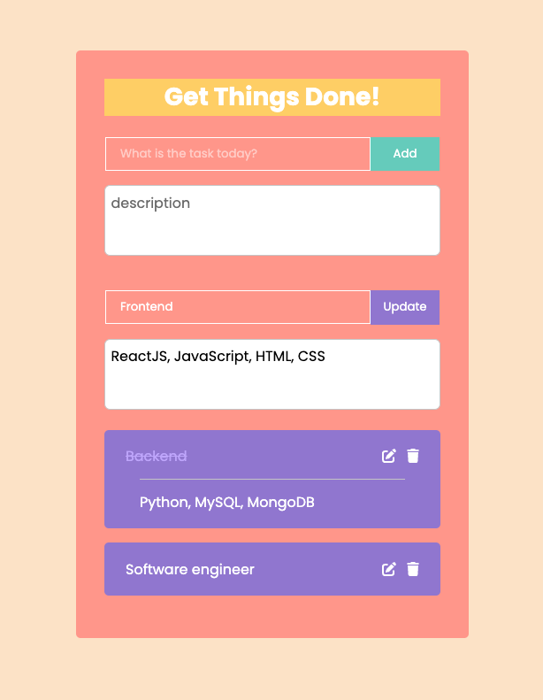

# To-do List built with React.JS (full-stack)
A simple but powerful To-do list App which is handly and easy to use.

## Technologies used
Frontend:
* React.JS framework
* JavaScript / HTML / CSS
* useState / useEffect
* async / await

Backend:
* Express.JS framework
* MongoDB
* RESTful API
* Routers

## Features
* Allows users to edit topics and details after adding a todo.
* Used line-through text decoration instead of a check box.
* Connect the backend database to allow users to store their to-do items.

## Set up
1. Clone this project.
2. cd to the project directory and run `npm start` to connect to frontend.
3. Open [http://localhost:3000](http://localhost:3000) to view it in your browser.

## Image of UI

